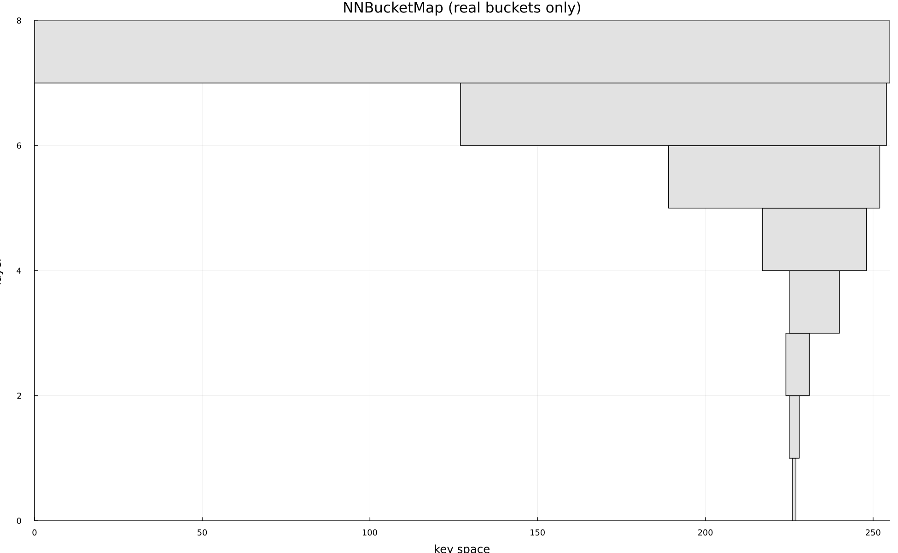

# Nearest Neighbor Bucket Map
This is a data structure designed to get a near neighbor given some key that doesn't exist in the structure. It utilizes a logarithmically sized stack of bucket maps.

## Use Case
The use case that I had when making this structure is an easy and time-efficient way to get a nearest neighbor of some integer or vector of integers. Essentially a nearest neighbor structure.

## Insertion
The following visual example is generating random keys from 0-255 and they resolve to grayscale values between 0-255.



Insertion climbs up the bucket layers, adding itself to the buckets and creating a new set in the bucket if there isn't already one. This means that - assuming average map operations and insertion into a set as O(1) - the average time complexity of an insertion is `O(log(s))` where `s` would be equivalent to the size of the key space. This structure could be dynamically sized in the future by checking the size of each key upon insertion and adjusting it accordingly.

## Deletion
Deletion is similar to insertion as it climbs the bucket layers, removing itself from the sets and removing the keys and set objects if the set is empty. This would also be on average `O(log(s))` similarly to insertion.

## Nearest Neighbor Search
This search climbs up the bucket layers like the other operations until it hits the first bucket with something in it, returning the first element from the set. This takes a worst case of `O(log(s))`. 

In the future this could be expanded such that we check buckets to the left and right of our found bucket to see which values are actually the closest. In this case, the average case would be something like `O(log(s) + 3b)` where `b` is the size of the bucket at the layer you reached. The worst case would be `O(log(s) + n)` for our traversal up the bucket layers into the very top bucket containing every data point (n). With sparse datasets this may not be ideal, however with increasing density, this time complexity lowers exponentially.

### Pseudocode
```pseudocode
Begin at the lowest bucket layer index (finest accuracy)

Check the current layer and check if the key exists.
If true
    return the value associated (set of values pointing to the bucket)
else
    Increment the bucket layer index to search
    fit the key to the new bucket size

repeat until found or no more buckets
```

## Empirical results
Here I make a use case of finding the nearest named color from some subset of all colors, given any hex color.

Given this code section of [results.jl](results.jl):
```julia
@benchmark color = nn(map, c) |> first
@benchmark color2 = getClosestNameLinear(c)
```
We find that for this specific hex color looking in a list of 17,000 other colors, the NNBucketMap has more than an order of magnitude better performance than linear.
```
BenchmarkTools.Trial: 10000 samples with 932 evaluations per sample.
 Range (min … max):  107.760 ns …  12.236 μs  ┊ GC (min … max): 0.00% … 98.88%
 Time  (median):     109.670 ns               ┊ GC (median):    0.00%
 Time  (mean ± σ):   114.200 ns ± 141.854 ns  ┊ GC (mean ± σ):  2.65% ±  2.70%

  ▂▆██▇▅▃▂ ▂▂▃▄▃▂▂                                              ▂
  █████████████████▇▆▅▄▄▄▅▄▆▃▄▅▆▆▅▅▄▆▅▅▆▆▅▅▄▄▄▃▁▄▁▄▄▄▄▄▃▁▄▁▁▅▄▃ █
  108 ns        Histogram: log(frequency) by time        141 ns <

 Memory estimate: 48 bytes, allocs estimate: 2.

BenchmarkTools.Trial: 1612 samples with 1 evaluation per sample.
 Range (min … max):  2.606 ms …  11.186 ms  ┊ GC (min … max):  0.00% … 74.95%
 Time  (median):     2.696 ms               ┊ GC (median):     0.00%
 Time  (mean ± σ):   3.098 ms ± 956.891 μs  ┊ GC (mean ± σ):  12.38% ± 17.22%

  █▇▆▅▃▁                                     ▁▁ ▁ ▁            
  ██████▇▇▆▇▇▄▁▄▄▄▁▁▁▁▁▁▁▁▄▅▄▅▄▅▁▁▁▁▁▁▁▁▁▄▁▅████████████▇▇▆▅▇ █
  2.61 ms      Histogram: log(frequency) by time      5.58 ms <

 Memory estimate: 6.87 MiB, allocs estimate: 179964.
```

# Notes
Using named colors from This repo: https://github.com/meodai/color-names

Also this might be an existing data structure that has a real name, so if it is please let me know!